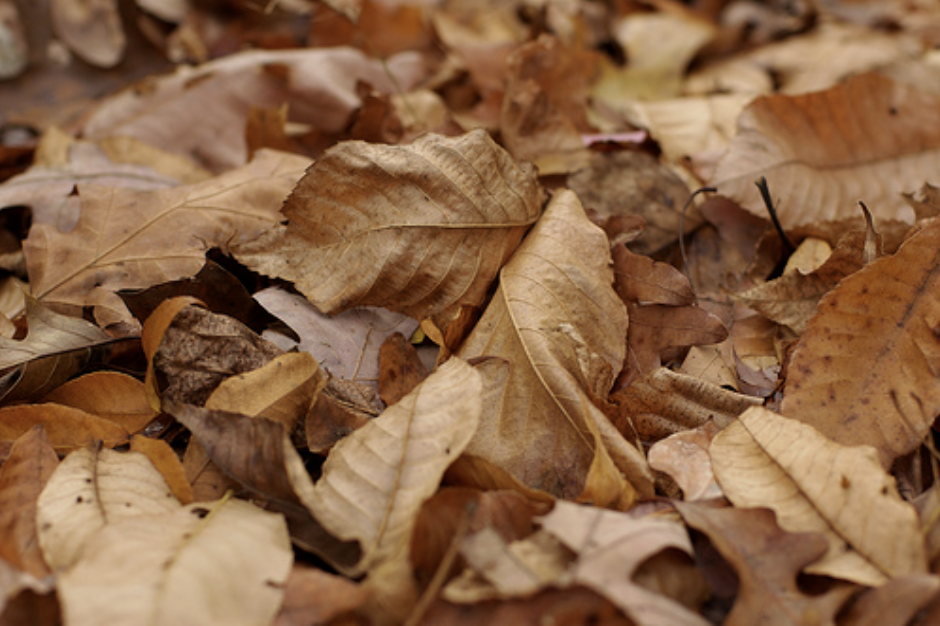
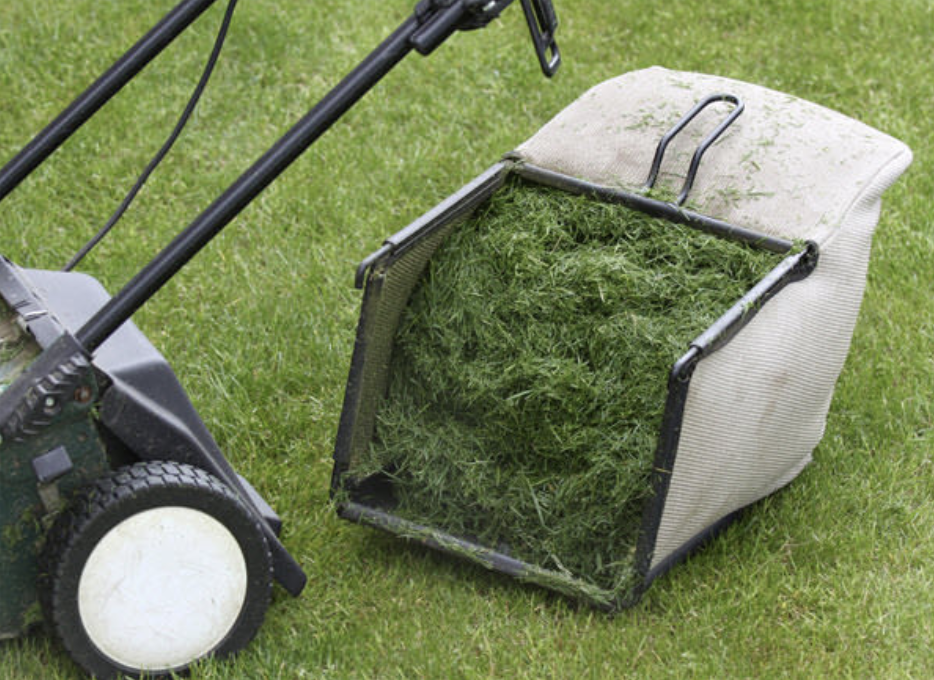
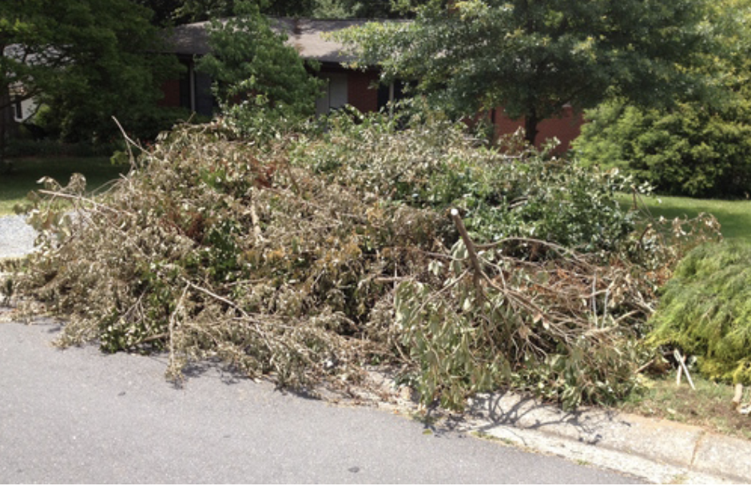

# New Pick Up Procedures

1. Collect yard waste and put in any bag. Make sure it is clearly labeled as “Yard Waste”.
1. Open up Facebook and head to the page fb.me/YardBot.
1. Send Yard Bot a message. Yard bot will prompt you to share the location of the waste pick up and/or a picture attachment of the waste. 
1. Finish the process by confirming waste collection posting.

## Examples of Yard Waste

“Yard Waste” may include the following:
 
### Dried Leaves

### Grass Clippings

### Fallen Dranches

## Other Home Disposal Methods

### Composting

You can add the dried leaves to your compost pile. Dried leaves are a little bit more difficult to compost. Adding any type of manure or grass clippings which contains a high level of nitrogen will help the process.  This will not only help you get rid of heaps of dried leaves, but now you have your own homemade, organic fertilizer!

### Mulch

Dried leaves have a lot of benefits when used as mulch for flowering or balcony plants. The leaves will help control weed growth around the plant, retain moisture in your soil, and protect against the temperature fluctuation which is very common in Chicago. The best part is the leaves will eventually decompose and add to the nutrients of the soil.

### Kindling

Bring a couple bags of leaves with you on camping trips to start your campfire. There is an abundance of leaves during the Fall time and they are a great replacement for fire starters!
